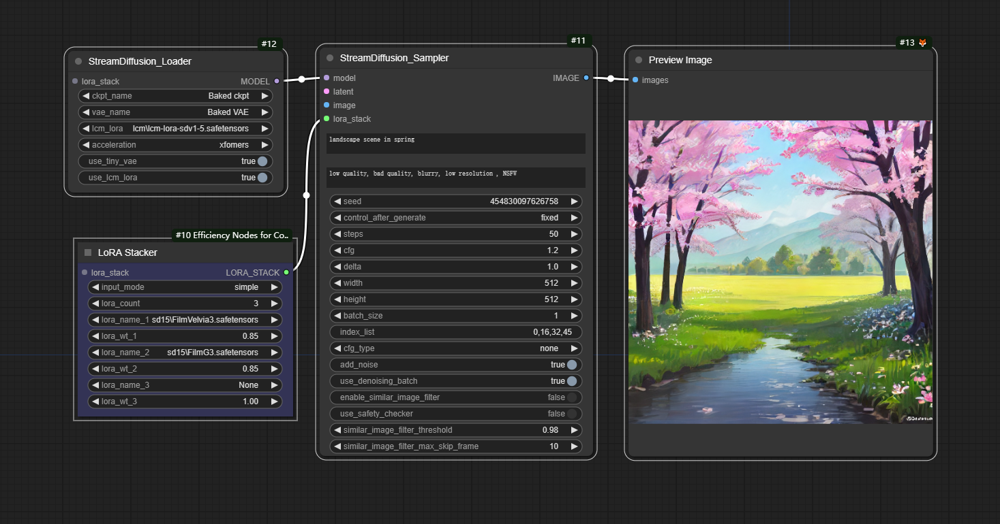

# ComfyUI_StreamDiffusion

# This is a simple implementation StreamDiffusion<a href="https://github.com/cumulo-autumn/StreamDiffusion.git" > for ComfyUI

# StreamDiffusion: A Pipeline-Level Solution for Real-Time Interactive Generation

**Authors:** [Akio Kodaira](https://www.linkedin.com/in/akio-kodaira-1a7b98252/), [Chenfeng Xu](https://www.chenfengx.com/), Toshiki Hazama, [Takanori Yoshimoto](https://twitter.com/__ramu0e__), [Kohei Ohno](https://www.linkedin.com/in/kohei--ohno/), [Shogo Mitsuhori](https://me.ddpn.world/), [Soichi Sugano](https://twitter.com/toni_nimono), [Hanying Cho](https://twitter.com/hanyingcl), [Zhijian Liu](https://zhijianliu.com/), [Kurt Keutzer](https://scholar.google.com/citations?hl=en&user=ID9QePIAAAAJ)

StreamDiffusion is an innovative diffusion pipeline designed for real-time interactive generation. It introduces significant performance enhancements to current diffusion-based image generation techniques.

# Simple Use
you can download the workflow image below , and import into ComfyUI

  

# img2img
 img2img can be done by send a image to the image imput in the sampler node,but the batch_size must be 1.

# StreamDiffusion_Sampler
Input Latent is not implemented for now.

  ### Lora stack
  You can set Lora stack by using LoRA Stacker from Efficiency Nodes.

## Support
Thank you for being awesome!